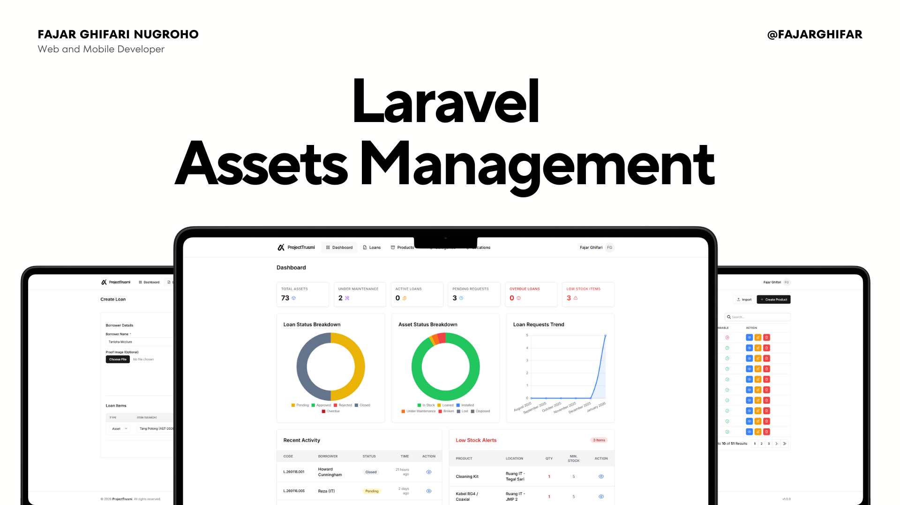

# Filament Assets Management 🏢


A comprehensive **Asset & Loan Management System** built with **Laravel 12** and **FilamentPHP v4**. Designed to streamline internal company operations, tracking assets (IT equipment, Furniture), consumable stocks, and employee loans with approval workflows.



---

## ✨ Key Features

### 📦 Asset Management
* **Lifecycle Tracking:** Complete history of every asset (Purchase, Assignment, Moving, Return, Disposal).
* **Location Management:** Track assets across multiple sites (Head Office, Branch) and specific room locations.
* **Smart Actions:**
    * **Check-In / Check-Out:** Assign assets to employees with automated history logging.
    * **Moving:** Transfer assets between locations with reason tracking.
    * **Maintenance Status:** Mark assets as "In Repair" or "Broken".

### 📊 Consumable Stock
* **Stock Tracking:** Manage inventory for disposable items (ATK, Paper, Ink, etc.).
* **Low Stock Alerts:** Dashboard indicators for items running below minimum thresholds.
* **Auto-Deduction:** Stock is automatically deducted when included in approved loan requests (as non-returnable items).

### 📝 Loan & Approval System
* **Employee Loans:** Request flow for borrowing assets or requesting consumables.
* **Hybrid Items:** Support for mixing **Returnable Assets** (Laptops, Projectors) and **Consumables** (Pens, Paper) in a single loan request.
* **Approval Workflow:**
    * **Pending:** Draft request waiting for admin review.
    * **Approved:** Items deducted from stock/status updated.
    * **Rejected:** Logged with rejection reason.
    * **Returned/Overdue:** Tracking return dates and overdue status.
* **Partial Returns:** Ability to return specific items from a bulk loan (e.g., returning 1 of 2 borrowed laptops).

### 📈 Dashboard & Reporting
* **Real-time Overview:**
    * Total Assets Value & Count.
    * Active Loans & Overdue Loans.
    * Low Stock warnings.
* **Interactive Charts:**
    * Monthly Loan Frequency.
    * Asset Status Distribution.
    * Top Borrowed Products.
* **Export/Import:** Bulk import assets via Excel and export reports for audit purposes.

---

## 🛠️ Tech Stack

* **Backend:** [Laravel 12](https://laravel.com/)
* **Admin Panel:** [FilamentPHP v4](https://filamentphp.com/)
* **Database:** MySQL / MariaDB
* **Charts:** [ApexCharts](https://filamentphp.com/plugins/leandrocfe-apex-charts) (via Filament Widgets)

---

## 🏗️ Architecture Highlights

1.  **Hybrid Persistence Architecture (`LoanForm` & `CreateLoan`):**
    *   Handles complex polymorphic relationships (Assets vs. Consumables) by manually processing form data in `handleRecordCreation` to ensure data integrity.
2.  **Observer Pattern:**
    *   **`LoanObserver`:** Generates unique loan codes (`LN/2024/...`) and handles status transitions.
    *   **`AssetObserver`:** Automatically logs every state change (move, status update) into the `AssetHistory` table.
3.  **Service Layer:**
    *   **`LoanApprovalService`:** Encapsulates business logic for approving/rejecting loans and updating asset statuses.
    *   **`LoanReturnService`:** Manages the complex logic of partial returns and stock restoration.
4.  **Localization (i18n):**
    *   Full support for **Indonesian (ID)** and **English (EN)** via standard Laravel translation files (`lang/id/resources.php`).

---

## 🚀 Installation Guide

### 1. Clone the Repository
```bash
git clone https://github.com/fajarghifar/filament-assets-management.git
cd filament-assets-management
```

### 2. Install Dependencies

```bash
composer install
npm install && npm run build
```

### 3. Environment Setup

Copy the example environment file:
```bash
cp .env.example .env
```
Open `.env` and configure your database:
```options
DB_CONNECTION=mysql
DB_HOST=127.0.0.1
DB_PORT=3306
DB_DATABASE=trusmi_assets
DB_USERNAME=root
DB_PASSWORD=
```

Generate the application key and storage link:
```bash
php artisan key:generate
php artisan storage:link
```

### 4. Database Setup & Seeding (Fast Reset)

This project uses a custom composer script to migrate and seed data in the correct order.
**Warning:** This command will wipe your database (`migrate:fresh`).

```bash
composer run reset
```
> *This script will sequentially run all seeders to populate initial data:*
> *   **Users:** Admin
> *   **Master Data:** Locations, Categories
> *   **Inventory:**
>     *   **Assets (IT):** Laptop ThinkPad, Toolkit Network, Printer, Switch.
>     *   **Consumables (Network):** RJ45 Connectors, Cable Ties, UTP Cables.

### 5. Run the Server

```bash
php artisan serve
```

Access the admin panel at `http://localhost:8000/admin`.

---

## 🔑 Default Credentials

| Role | Email | Password |
| --- | --- | --- |
| **Admin** | `admin` | `password` |

> **Note:** Please change credentials immediately after deployment.

---

## 📖 Usage Guide

### 📦 Inventory Workflow

The system uses **Product** as the master parent table for all items.

1.  **Create Product (Master):**
    *   Go to **Inventory > Products**.
    *   Create a new product (e.g., "MacBook Pro M3" or "RJ45 Connector").
    *   Select the type: **Asset** (Fixed Item) or **Consumable** (Disposable).

2.  **Add Stock/Units:**
    *   **For Assets:** Go to the **Assets** menu (or via Product relations). Register individual units with unique ID/Tag (e.g., `AST-001`, `AST-002`).
    *   **For Consumables:** Go to **Consumable Stocks**. Add stock quantity to a specific location (e.g., "Warehouse A: 500 pcs").

### 🔄 Managing Operations
*   **Assets Operations:**
    *   **Check Out:** Assign a specific Asset ID to an employee.
    *   **Move:** Transfer Asset from one Location/Site to another.
*   **Loan Request:**
    *   Create a Loan for mixed items (1 Laptop + 5 Connectors).
    *   System automatically validates availability.
1. Employees (or Admin acting as one) create a **Loan** request.
2. Add items: Select **Product** -> System detects if it's an **Asset** (shows specific units) or **Consumable** (shows stock qty).
3. **Admin** goes to the Loan record and clicks **Approve**.
4. When returning, click **Return Items** to process full or partial returns.

---

## 📄 License

This project is open-sourced software licensed under the [MIT license](https://opensource.org/licenses/MIT).

---

**Made with ❤️ by Fajar Ghifari Nugroho**
